# **Práctica2**: Instalación y configuración de servidor y cliente DHCP en Debian.


##### Carlos Mallavia Belmonte
---

## Indice:

- [Enunciado](#enunciado)  
- [Configuraciones](#configuraciones-de-las-maquinas)
  * [PfSense](#configuración-de-la-maquina-de-pfsense)
  * [Debian12](#configuración-de-la-maquina-debian12)
    + [Configuracion servidor DHCP](#configuracion-del-servidor-dhcp)
    + [Encender servidor y comprobaciones finales](#poner-en-marcha-el-servidor-y-comprobaciones-finales)
- [Comprobacion del cliente](#comprobacion-en-el-cliente)


### Enunciado:

#### Esta actividad consiste en realizar un tutorial en el que se describan los ficheros involucrados y los comandos necesarios para configurar el servidor isc-dhcp server en Debian. Este tutorial se realizará en lenguaje Markdown y será publicado en GitHub
---
 
### Configuraciones de las maquinas.

* Para esta practica debemos de configurar **3 maquinas**: un router PfSense, un Debian12 y una maquina de windows 10.

#### Configuración de la maquina de PfSense.


* Empezaremos con el router PfSense.  
Tenemos que asegurarnos que la direccion LAN del pfSense marque la que nos decia la guia, 192.168.XX.1/24 donde X sera el numero de lista en clase, que en mi caso es el 10, entonces la Ip quedaria como 192.168.10.1/24.

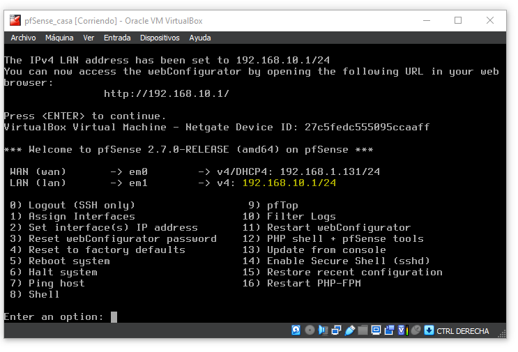

Si por alguna razon nos sale otra dirección la podemos cambiar manualmente introduciendo la opción 2 (escribimos 2 y enter) elegimos la opcion de LAN y la ponemos a mano.

* Y esto es todo lo que se configura del pfSense.  

#### Configuración de la maquina Debian12.

* Esta es la parte más larga y en la que hay que tener más cuidado al modificar los archivos.

* Comenzamos configurando la direccion IP, para eso en ajustes en el apartado de "RED", desactivamos la conexion  y entramos a la rueda dentada para editar la configuracion. 

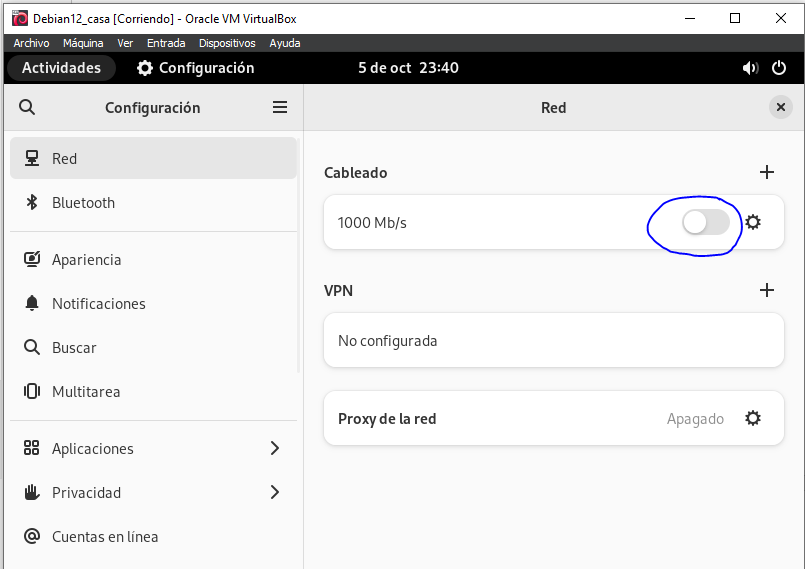

* Una vez dentro vamos al apartado de IPv4 y cambiamos el método a manual e introducimos la direccion. Importante que la puerta de enlace direcciones a la del pfSense.

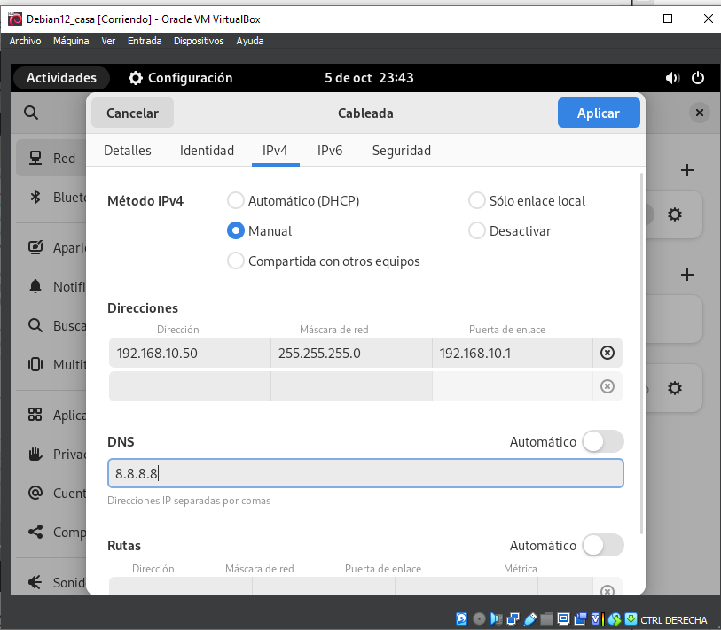
**(Se introduce la 50 porque asi lo determina la guia. La dirección 50 para el servidor DHCP)**

* Le damos a aplicar y volvemos a activar la conexión.  

### Configuracion del servidor DHCP
Y con el comando `ip addr` en la terminal de comandos podemos comprobar que teneos ya la IP necesaria.

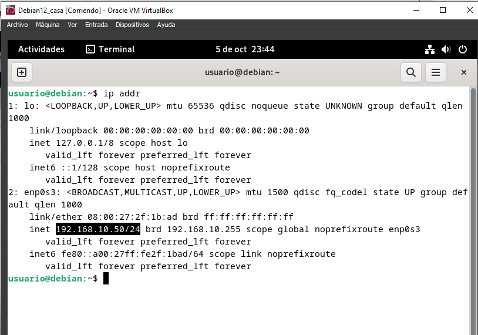

* Ahora, muy importante. Hay que recordar el nombre de la tarjeta de red, en mi caso se llama ***enp0s3*** y en el archivo ubicado en  
`/etc/default/isc-dhcp-server`  
hacemos un: 
```
cat /etc/default/isc-dhcp-server
```  
* Deberia de poner, entre otras cosas, "INTERFACES" tanto v4 para IPv4 y v6 para IPv6. En mi caso el archivo no existia, no pasa nada, con el comando:
```
nano /etc/default/isc-dhcp-server
```  
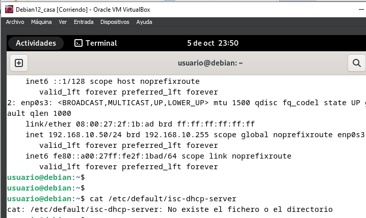

* Creamos el archivo y añadimos las dos interfaces como indica la foto, en la interfaces "INTERFACEv4" hay que pones el nombre de la tarjeta de red que sacamos antes con `ip addr`.

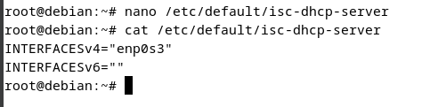

* Ahora con el comando:
```
apt install isc-dhcp-server
```
* Instalamos el servidor *DHCP* y solo quedaria configurar el servidor como tal.

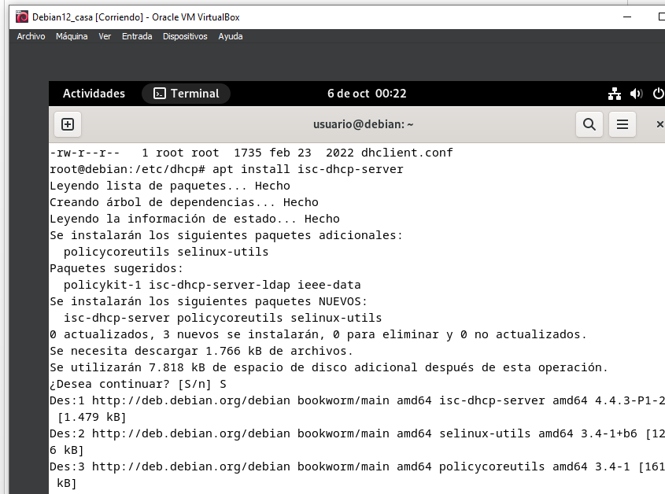

* Una vez instalado en la ruta "/etc/dhcp", que es la ruta donde se guarda la info del servidor *DHCP* introducimos el comando:
```
ls -alt
```
* Con este comando podemos ver los archivos en orden de creacion, el que nos interesa y el que vamos a modificar es el fichero con nombre: `dhcp.conf`

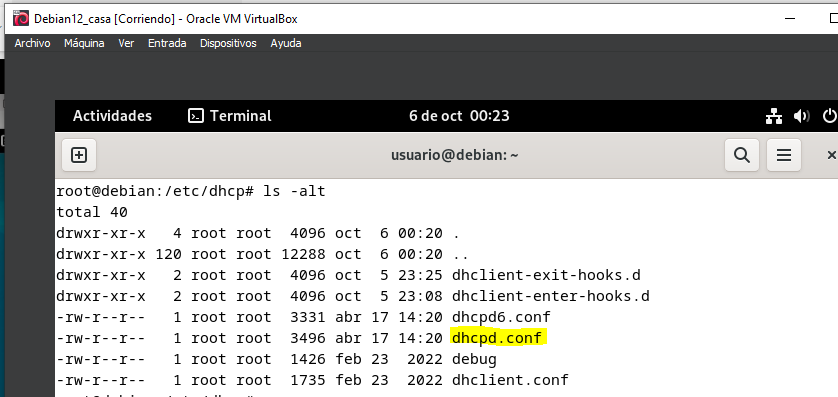

* Este archivo es el que nos permitira configurar el servidor, en cierto modo, como si fuera Windows.

* Ahora por si acaso pasa cualqueir cosa con el archivo, vamos a realizar una capia o backup de recuperacion. 
Para ello inntroducimos el comando:
```
cp dhcpd.conf dhcpd.conf.copia
```
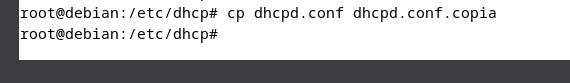
**(Yo pongo al final `.copia` pero puedes llamarlo, por ejemplo, `.backup` o como más quieras.)**

#### * Bien vamos a proceder con la configuración del archivo. Para ello metemos el comando:  
```
nano dhcpd.conf
```  
* Nos saldran varias "plantillas" de posibles formas de configuraciones, bajamos un poco y la que mejor se adapta a nosotros es la que empieza con:
> A slightly different configuration for an internal subnet.
* Que se ve tal que asi:

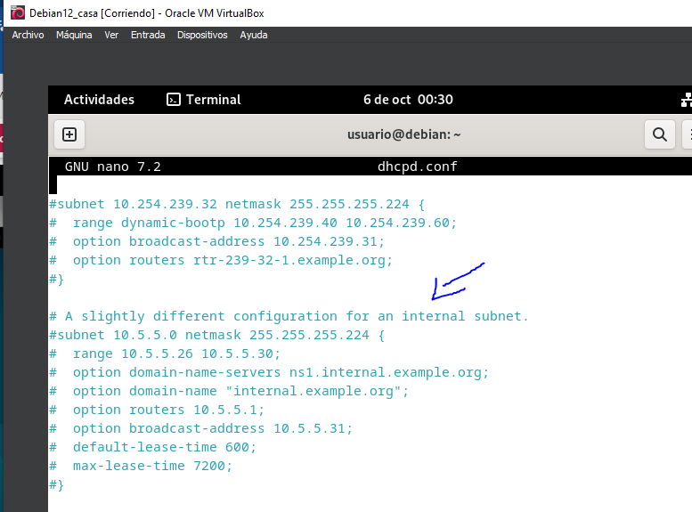

* Como podemos ver esta todo con comentarios *(han usado el simbolo "#" para hacer que los comandos sean comentarios y no influyane en el codigo)*

* Para poder seleccionar esa plantilla, debemos de quitar las "#" de donde dice: 
> subnet 10.0.5.0 netmask 255.255.255.224 {  
* Y tambien al final donde se cierra la llave.

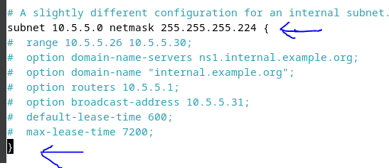

* Ahora connfiguramos las diferentes opciones como si fuera un **ambito** de Windows. Más o menos se parece.

* En la siguiente foto:

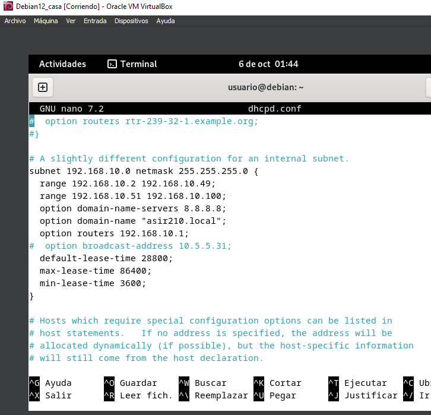


* Bien con esto vamos desglosando un poco. La primera lines en donde pone:
>subnet 192.168.10.0 netmask  255.255.255.0 {

* Sirve para poner la direccion Ip, que como nos marcaba la guia, la red deberia de ser 192.168.10.0/24.  
Las dos siguientes lineas que dicen:
> range 192.168.10.2 192.168.10.49;  
range 192.168.10.51 192.168.10.100  

* Serian los rangos de Ip permitidos en el servidor, como vemos al principio solo sale una lines de `range` pero podemos añadir más IP añadiendo mas `range`, o rangos en ingles, justo debajo de la otra  
**(Falta la 10.50 pues esa IP es la del servidor y claro, no la puede dar)**

* La siguiente linea es el DNS, en la foto esta puesto la del instituto.
Seguido tenemos el nombre de dominio, que como indica la guia, debe de ser `asir210.com` **(podemos poner `.local` en vez de `.com` pero Debian a veces da errores con el `.local`).**

* Ahora viene la puerta de enlace que marcar a la puerta de enlace del pfSense (Si no esta configurado mirar: [Configuracion PfSense](#configuración-de-la-maquina-de-pfsense))

* Como ultimo tebemos el tiempo de cesiones. La primera linea:
> Default-lease-time 
* Es para el tiempo (en segundos) predeterminado en el que el servidor dara una IP.  
Las siguientes lineas, al tener `max` y `min` nos estan indicando el tiempo **maximo** que un equipo puede tener una IP **(yo cambie lo que venia predeterminado y puse 86400" que equivale a 24 horas)** y con `min` nos indica el tiempo **minimo** que un equipo tiene que esperar para pedir otra IP y no saturar la red **(lo mismo, edite el tiempo predeterminado y puse 3600" equivalente a 1 hora)**

* Bien ya hemos acabado de configurar el servido o ambito, como prefieras llamarlo. Ahora vamos a configurar una **reserva**. Para esto bajamos un poco mas en el archivo hasta encontrarnos con un apartado que pone:
>host fantasia  {

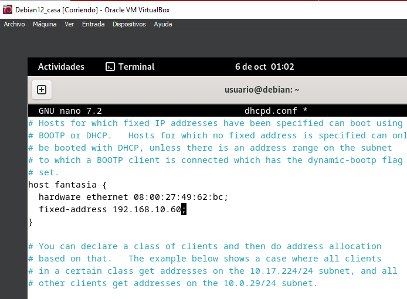

* Y al igual que antes, quitamos las pimeras "#" para que el codigo se active, por asi decirlo. Bueno y tambien las "#" de las otras dos lineas.

* Aqui en donde pone `hardware ethernet` tenemos que pones la MAC de un equipo, yo use la dirección de un equipo Debian11 que tenia ya creado y le di como IP fija de reserva la 192.168.10.60 

* Con esto termminamos la configuracion del servidor DHCP.

### Poner en marcha el servidor y comprobaciones finales.

* Como ya esta todo configurado en el archivo `dhcpd.conf` introducimos `control+o` para guardar los cambios y `control+x` para salir.

***Importante***:  
* Cuando editemos el archivo `dhcpd.conf` debemos **siempre**, reinicar el servidor. Para ello usaremos los comandos:
```
systemctl stop isc-dhcp-server
```
* Este comando **detiene** el servidor.
```
systemctl star isc-dhcp-server
```
* Este encambio, lo inicia pero para evitar esto podemos usar directamente:
```
systemctl restart isc-dhcp-server
```
* Con este se reinicia el servidor directamente.  
Y por ultimo con el comando:
```
systemctl status isc-dhcp-serve
```
* Vemos como esta el servidor. Lo importante de este comando en la parte de `Active` (más o menos la 2 linea).  
Esta parte tiene que estar en **verde** y poner **`active (running)`**.
* Sabiendo esto, apagamos el servidor y lo volvemos a encender y tiene que estar asi.

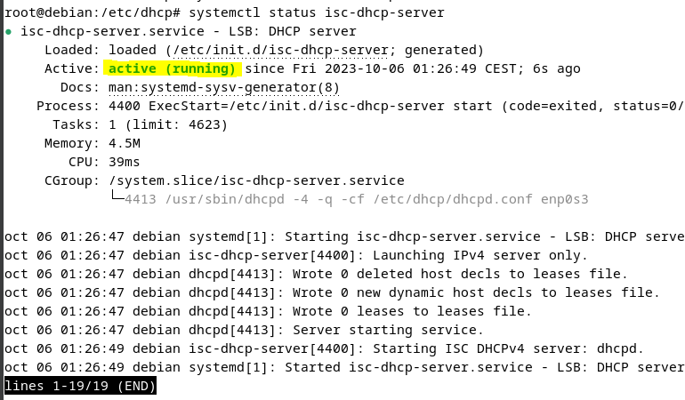

* Lo siguiente que tenemos que comprobar es que el servidor este escuchando en el puerto correcto, el puerto 67. Para ello ponemos el comando:
> ss -ltun
* Y nos sale estas lineas:

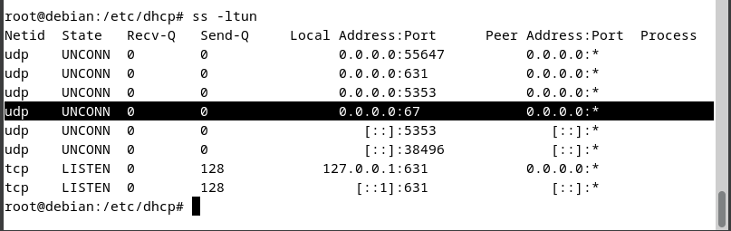

* Como podemos ver esta *"escuchando"* y listo para el enviar IPs.

### Comprobacion en el cliente.

* Entonces con el servidor de DHCP (Debian) configurado (si no lo esta mirar: [Debian](#configuración-de-la-maquina-debian12)) y con el pfSense tambien configurado (si no lo esta mirar: [PfSense](#configuración-de-la-maquina-de-pfsense)) podemos irnos a un cliennte de Windows 10 y automaticamente nos daria la Ip con la que a su vez podriamos navegar por internet.
* Paralelo a esto podemos ver como el servidor DHCP, en la ruta `/var/lib/dhcp`, haciendo un:
```
ls
```
* Nos saldran 2 archivos, despues un:
```
cat dhcpd-leases
```
* Y en ese archivo nos saldria la direccion del equipo al que ha dado la IP, con nombre y todo. Ahora, como vemos en la foto, no sale nada.
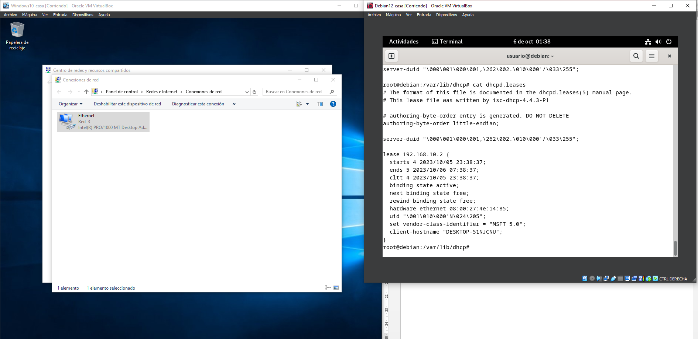

* Una vez arranque el windows, miramos la Ip que tiene con el comando:
```
ipconfig
```
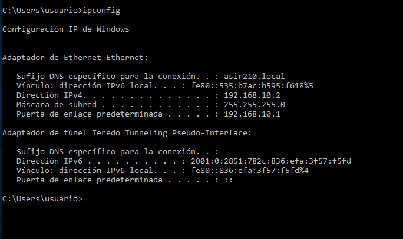

* Una vez arranco, probamos ha hacer un ping:

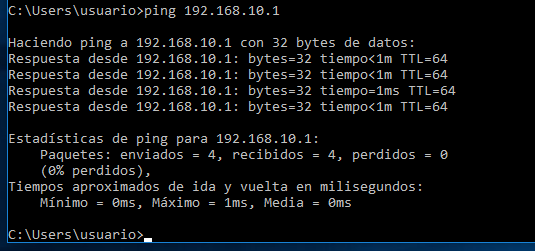

* Por ultimo comprobamos que tiene internet yendo a microsoft explorer y buscando, por ejemplo, `marca.com`.


### Extra: Errores que puedan saltar.

* A veces pueden darse un error en el codigo y, aunque mires y mires, puedes saltartelo pues, seguramente, el error sea una letra o una palabra mal escrita.

* Para no perder tiempo, podemos mirar exactamente cual es el fallo. Por ejemplo al inicar el servidor con:
```
systemctl start isc-dhcp-server
```
* Instalare el servidor en una maquina limpia y no cofigurare nada. El error que tendria que saltar, obviamente, es que no he configurado nada, ni la red ni el ambito del servidor. 
* Entonces al instalar el servidor con el comando:
```
apt install isc-dhcp-server
```

* E introducir el comando:
```
journalctl -u isc-hdcp-service.service
```

* Nos saldran los errores por los que no arranca el servidor.

* Como solo he instalado el servidor y no he configurado nada en la parte de red pues el error que nos salta es "No subnet declaration for enp0s3 (10.0.16.41)" Lo que quiere decir que no he declaro nada en el "ambito" del servidor, ni la red ni la exclusiones, nada. Lo que tendria que hacer ahora es revisar el [archivo](#bien-vamos-a-proceder-con-la-configuración-del-archivo-para-ello-metemos-el-comando) de configuracion del servidor y arrelar el fallo. Y si no revisar la instalacion de [Debian12](#configuración-de-la-maquina-debian12).